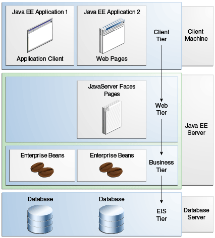

# DIT5307 End-of-Semester Examination — Semester Two 2024/25

**Programme Code:** DS125109 / DS145109
**Module Title:** Enterprise Architecture & System Development
**Module Code:** DIT5307
**Date:** 19 May 2025
**Time:** 2:00 p.m. – 5:00 p.m.
**Time Allowed:** 3 hours

---

## Section B (80 marks) — Answer ANY FOUR (4) questions

---

## Question B1

**(a)** Describe what is meant by *enterprise application software*. What are the characteristics of an enterprise application? **(4 marks)**

*Answer:*

**Enterprise application software** is large-scale software designed to satisfy the needs of a large organisation such as a business or government. It consists of a group of programs with shared business applications (and organisational modelling utilities) designed specifically for the organisation.

**Characteristics of an enterprise application:**
- **Complex** — involves many business rules and workflows.
- **Mission critical** — must be highly reliable and available.
- **Scalable** — able to support large and growing numbers of users / transactions.
- **Component-based** — built from reusable, loosely-coupled components.
- **Distributed** — components run across multiple machines / tiers, often over a network.

---

**(b)** Java Platform, Enterprise Edition (Java EE) uses a multi-tiered application model for enterprise applications.

**(i)** Draw a diagram to show the different tiers of this application model, clearly marking which tier(s) correspond(s) to the Java EE server, the database server and the client machine respectively, as well as showing the type of component in each tier. **(6 marks)**

*Answer:*



```
+-------------------------------+
|        Client Tier            |   <-- Client machine
|  (Web Pages / Application     |
|   Clients in browsers / JVMs) |
+---------------+---------------+
                |
+---------------v---------------+
|         Web Tier              |   \
|  (JSF Pages / JSP / Servlets  |    |
|   / (X)HTML)                  |    |
+---------------+---------------+    |
                |                    |--> Java EE Server
+---------------v---------------+    |
|       Business Tier           |    |
|  (Enterprise Beans / EJBs)    |    /
+---------------+---------------+
                |
+---------------v---------------+
|   EIS (Database) Tier         |   <-- Database server
|        (Database)             |
+-------------------------------+
```

- **Client Tier** — runs on the **client machine**, contains Web Pages / Application Clients.
- **Web Tier** — runs on the **Java EE server**, contains JSF Pages / JSP / Servlets / (X)HTML.
- **Business Tier** — runs on the **Java EE server**, contains Enterprise Beans (EJBs).
- **EIS Tier** — runs on the **database server**, contains the Database.

**(ii)** Describe briefly the components corresponding to the Java EE server. **(4 marks)**

*Answer:*

The Java EE server hosts components of the **Web Tier** and the **Business Tier**:

- **Servlets** — Java classes that dynamically process HTTP requests and construct HTTP responses.
- **JSP pages** — text-based documents that execute as servlets but allow a more natural approach to creating static content with embedded dynamic content.
- **JSF (Facelets) pages** — provide a user-interface component framework for web applications, following the MVC pattern.
- **Enterprise Beans (EJBs)** — components that handle the business logic that solves or meets the needs of a particular business domain (e.g., session beans, message-driven beans).

---

**(c)** Refer to the following code snippets from three source files `login.html`, `greeting.jsp` and `GreetingServlet.java` of a certain Java Web application.

`login.html`
```html
...
<form action="greet" method="post">
    ...
    <label>User name:</label>
    <input type="text" name="username" required>
    ...
</form>
```

`greeting.jsp`
```jsp
...
<p>Hello ${username}, Good ${time},.</p>
...
```

`GreetingServlet.java`
```java
...
@WebServlet("/greet")
public class GreetingServlet extends HttpServlet {
    ...
    @Override
    protected void doPost((i)____________ request,
            HttpServletResponse response)
            throws ServletException, IOException {
        String timeText = "morning";
        String inputName = (ii)______________________;
        if (...)  // now is between 12:00 and 17:59
            timeText = "afternoon";
        else if (...)  //  now is between 18:00 and 23:59
            timeText = "evening";

        (iii)___________________((iv)_______, timeText);
        (iii)___________________((v)________, inputName);

        getServletContext()
                . (vi)______________________ ("/greeting.jsp")
                . forward (request, response);
    }
    ...
}
```

Fill in the missing source code. **(6 marks)**

*Answer:*

- **(i)** `HttpServletRequest`
- **(ii)** `request.getParameter("username")`
- **(iii)** `request.setAttribute`
- **(iv)** `"time"`
- **(v)** `"username"`
- **(vi)** `getRequestDispatcher`

---

## Question B2

**(a)** Suggest the best type of enterprise bean for each of the following scenarios. Explain your suggestion.

**(i)** An online e-commerce platform which sells hundreds of different types of items provides a shopping cart feature which lets a user virtually 'put' items in or 'remove' items from the cart while browsing different products.

*Answer:*
- **Stateful session bean**
- Reasons:
  - The operation involves several steps (i.e. method calls).
  - Client-specific state must be retained between method calls during the session.

**(ii)** When a user of a global air ticket booking website is viewing air ticket, the website shows the total number of users who are also viewing the same flight.

*Answer:*
- **Singleton session bean**
- Reasons:
  - This is a kind of counter which is shared across the whole application and concurrently accessed by clients.

**(iii)** A currency web portal shows the current price of a foreign currencies after the user enters the exchange code.

*Answer:*
- **Stateless session bean**
- Reasons:
  - The task can be completed with a single method call.
  - No client-specific states need to be kept between method calls.
  - (Pooled stateless session beans offer better scalability, which is crucial to the case as requests tend to be frequent.)

**(9 marks)**

---

**(b)** To implement the shopping cart mentioned above in part (a)(ii), the development team has decided to code an enterprise bean with remote access. Also, as a good practice, the bean will implement a business interface. Refer to the source code given below and answer the following questions:

```java
...
(i)/* annotation missing here */
public class CartEJB implements ShoppingCart, Serializable {
    ...
    private List<SelectedItem> selectedItems;

    @PostConstruct
    public void doInit() {
        ...
        selectedItems = new ArrayList<>();
    }

    @Override
    public void put(String itemID, int Qty) {
        ...
    }

    @Override
    public void remove(String itemID, int Qty) {
        ...
    }

    @Override
    public List<SelectedItem> getAll() {
        List<SelectedItem> results = new ArrayList<>();
        results.addAll(selectedItems);

        return results;
    }

    @Remove()
    @Override
    public void clearAll() {
        selectedItems = null;
    }
}
```

**(i)** Write a Java annotation which should replace the comment `/* annotation missing here */`. **(1 mark)**

*Answer:*
```java
@Stateful
```

**(ii)** Write the interface declaration for `ShoppingCart`, including all necessary annotation(s). You are NOT required to write package and import statements. **(6 marks)**

*Answer:*
```java
@Remote
public interface ShoppingCart {
    public void put(String itemID, int Qty);
    public void remove(String itemID, int Qty);
    public List<SelectedItem> getAll();
    public void clearAll();
}
```

**(iii)** One of the team members suggests that `getAll()` method just needs to `return SelectedItem` but do nothing else. Do you agree? Why? **(4 marks)**

*Answer:*

**Yes.**
- With remote access, method return values are copies (return by value), so there is no need to copy the contents of the list by ourselves.
- Information hiding (or encapsulation) is upheld (or side effects cannot occur, etc).

**OR**

**No.**
- Although with remote access, method return values are copies (return by value) and there is no need to copy the contents of the list by ourselves, this is a kind of side effect which should not be depended on (e.g., maybe someday we want to change the EJB to local access, etc.).

*Remarks:* 1 mark for 'Yes' or 'No' given only if supported with valid reasons.

---

## Question B3

**(a)** Compare and contrast a message-driven bean with a stateless session bean. **(10 marks)**

*Answer:*

**Similarities** (any 6 of the keywords/key phrases):
- A message-driven bean's instances retain no conversational state for a specific client.
- All instances of a message-driven bean are equivalent.
- The EJB container can assign a message to any message-driven bean instance.
- The container can pool these instances to allow streams of messages to be processed concurrently.
- A single message-driven bean can process messages from multiple clients.

**Differences:**
- Client components do not locate message-driven beans and do not invoke methods directly on them. (A message-driven bean never has a client view / no business interface exposed to clients.)

---

**(b)** What is the advantage of using message-driven beans to receive messages in a Java EE server? **(4 marks)**

*Answer:*
- Message-driven beans consume (or receive) messages asynchronously.
- Server resources will not be tied up because of blocking synchronous receives in a server-side component.
- Better performance (or scalability, etc.) can be achieved.

---

**(c)** Source code snippets of a message-driven bean which receives messages sent to a destination with JNDI name `jms/THEiQueue` in a point-to-point style is given below.

```java
...
(i)____________(activationConfig = {
    @ActivationConfigProperty(
            propertyName = (ii)______________,
            propertyValue = "jms/THEiQueue"
    ),
    @ActivationConfigProperty((iii)______________________________)
})
public class THEiMessageBean (iv)______________________________ {
    public THEiMessageBean() {
    }
    @Override
    (v)______________________(Message message) {
        // code for processing message goes here
    }
}
```

Fill in the missing source code. **(6 marks)**

*Answer:*
- **(i)** `@MessageDriven`
- **(ii)** `"destinationLookup"`
- **(iii)** `propertyName = "destinationType", propertyValue = "javax.jms.Queue"`
- **(iv)** `implements MessageListener`
- **(v)** `public void onMessage`

---

## Question B4

**(a)** Refer to some simplified JSP source code implementing a shopping cart of a legacy online e-commerce application as follows.

```jsp
<body>
    <%@ page import="java.util.List, ..." %>
    ...
    <%
        List selectedItems=(List)request.getAttribute("items");
    %>
    <table>
        <tr>
            <th>Item Description</th>
            <th>Unit Price</th>
            <th>Quantity</th>
        </tr>
        <%
            for (SelectedItem item : selectedItems) {
        %>
        <tr>
            <td><%= item.getItemDescription()%></td>
            <td><%= item.getUnitPrice()%></td>
            <td><%= item.getQuantity()%></td>
        </tr>
        <%
            } // end for
        %>
    </table>
    ...
</body>
```

Since it is now considered bad practice to code scriptlets (code within `<% %>`), you are required to rewrite the code shown in **bold** above with EL and JSTL so that all `<% %>` scriptlets and `<%= %>` expressions are removed. You can safely assume that `Book` class is a legitimate JavaBeans component and you are NOT required to include the `taglib` directive that specifies the use of the JSTL core library in your answer. **(10 marks)**

*Answer:*
```jsp
<table>
    <tr>
        <th>Item Description</th>
        <th>Unit Price</th>
        <th>Quantity</th>
    </tr>
    <c:forEach var="item" items="${selectedItems}">
    <tr>
        <td>${item.itemDescription}</td>
        <td>${item.unitPrice}</td>
        <td>${item.quantity}</td>
    </tr>
    </c:forEach>
</table>
```

---

**(b)** To better comply with the Model-View-Controller (MVC) pattern, the online e-commerce platform decides to use JSF technology. Rewrite the code in part (a) with Facelets. Assume that the backing bean shown below has been properly coded already. **(10 marks)**

```java
...
@Named
@SessionScoped
public class ShoppingCart implements Serializable {
    ...
    public List<SelectedItem> getCartItems () {
        // Return a List of all items in the cart
        ...
    }
    ...
}
```

*Answer:*

```xhtml
<h:dataTable value="#{shoppingCart.cartItems}" var="item">
    <h:column>
        <f:facet name="header">Item Description</f:facet>
        #{item.itemDescription}
    </h:column>
    <h:column>
        <f:facet name="header">Unit Price</f:facet>
        #{item.unitPrice}
    </h:column>
    <h:column>
        <f:facet name="header">Quantity</f:facet>
        #{item.quantity}
    </h:column>
</h:dataTable>
```

Notes:
- `#{shoppingCart.cartItems}` is the EL expression that invokes `getCartItems()` on the named, session-scoped backing bean.
- Facelets uses the JSF tags `<h:dataTable>` / `<h:column>` / `<f:facet>` (declared by the `xmlns:h="http://xmlns.jcp.org/jsf/html"` and `xmlns:f="http://xmlns.jcp.org/jsf/core"` namespaces in the root element).

---

## Question B5

An entity class `Address` is used to represent a typical address in Hong Kong. Field `id` is used as the primary key, whose value is provided automatically by the database. To be a valid address, there must be something in the `street` and `territory` (HK, KL or NT) fields and `territory` must be of length 2. An address is associated with another entity class `Person` such that a person entity can have one or more addresses. Consider the following source code snippets:

`Address.java`
```java
...
import java.io.Serializable;
import javax.persistence.*;
import javax.(i)____________.*;
(ii)____________
(iii)______________________________ {
    (iv)____________
    private String street;
    private Long id;
    private String flat;
    private int floor;
    private String block;
    private String estate;
    @NotBlank
    (v)______________________
    private String district;
    @(vi)________((vii)______________, (viii)____________)
    private String territory;
    private boolean isPrimary;
    (ix)____________
    private Person person;
    private boolean active;

    // Constructor, setter and getter methods, etc
    ...
}
```

`Person.java`
```java
...
import javax.persistence.*;
...
............ Person .................... {
    ...
    (x)______________________________
    private Collection<Address> addresses;
    ...
}
```

`AddressManager.java`
```java
...
import javax.ejb.Stateless;
import javax.persistence.*;
@Stateless
public class AddressManager {
    (xi)______________________
    private (xii)______________________ em;

    public void save(Address address) {
        em.persist(address);
    }

    public void delete(Address address) {
        em.(xiii)________(address);
    }
    // Other methods go here ...
}
```

**(a)** Fill in the missing source code. **(16 marks)**

*Answer:*

- **(i)** `validation` &nbsp; (i.e. `import javax.validation.constraints.*;`)
- **(ii)** `@Entity`
- **(iii)** `public class Address implements Serializable`
- **(iv)** `@Id @GeneratedValue(strategy = GenerationType.IDENTITY) @NotBlank` &nbsp; (`@Id` and `@GeneratedValue` belong to the `id` field; `@NotBlank` ensures `street` is non-empty)
- **(v)** `@Size(min = 1, max = 50)` &nbsp; (length constraint on `district`)
- **(vi)** `Size`
- **(vii)** `min = 2`
- **(viii)** `max = 2`
- **(ix)** `@ManyToOne`
- **(x)** `@OneToMany(mappedBy = "person", cascade = CascadeType.ALL)`
- **(xi)** `@PersistenceContext`
- **(xii)** `EntityManager`
- **(xiii)** `remove`

---

**(b)** Use a comparison table to show any four different between Java EE and Spring Framework. **(4 marks)**

*Answer:*

| Aspect | Java EE | Spring Framework |
|---|---|---|
| Nature / Origin | A **specification / standard** (JSR) implemented by multiple vendors (GlassFish, WildFly, WebLogic, etc.). | An **open-source framework / library** developed by Pivotal/VMware. |
| Runtime container | Requires a **full Java EE application server** to deploy (provides EJB, JMS, JTA, etc. out of the box). | Runs in any **plain servlet container** (e.g. Tomcat) or stand-alone JVM; brings its own container via the IoC/DI core. |
| Configuration style | Mainly **annotation-driven** with standardised annotations (`@EJB`, `@Entity`, `@Inject`, …); XML descriptors are optional. | Annotation- and Java-config-driven (`@Component`, `@Autowired`, `@Configuration`); historically heavy use of XML; Spring Boot favours convention over configuration. |
| Persistence | **JPA** is the standard, fully integrated with EJB / container-managed transactions. | Supports JPA, but also Spring Data, JDBC templates, MyBatis, etc.; transactions handled via `@Transactional` from the Spring TX module. |
| Dependency Injection | **CDI** (`@Inject`) — standard, type-safe. | Spring **IoC container** (`@Autowired`) — predates CDI, richer ecosystem. |
| Web layer | **JSF / Servlets / JAX-RS** as standards. | **Spring MVC / Spring WebFlux** — non-standard but very widely adopted. |

*(Any four rows of the above are acceptable.)*

---

*— End of Paper —*
